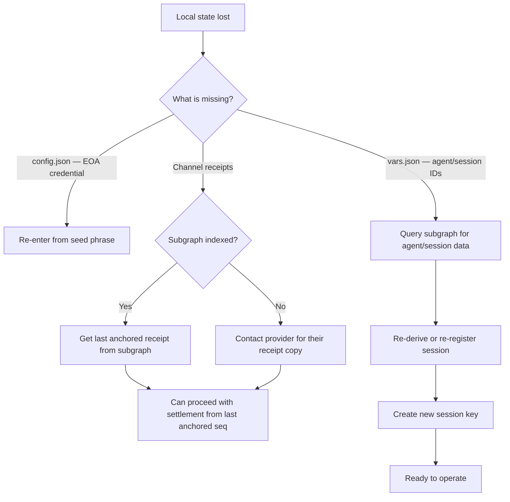

# Indexer Sync

## Three Sources of Truth

Kite Agentic Pay maintains state in three places simultaneously, and understanding the relationship is important for recovery and observability.

| Source | What it knows | Latency | Required? |
|---|---|---|---|
| **Local state** (`~/.kite-agent-pay/`) | Session keys, channel receipts, agent IDs | Immediate | Yes |
| **On-chain state** (contracts) | Channel status, balances, session validity | 1–3 blocks | For validation |
| **Subgraph** (Goldsky) | Full event history, aggregated entities | Minutes | No |

---

## Local State Is Primary

For **operation** — making payments, signing receipts, tracking call counts — local state is the only thing that matters. The SDK reads from local files and writes signed receipts back to local files. No indexer query is needed.

For **observability** — viewing payment history, checking session usage across devices, querying total spend — the subgraph is used.

For **validation** — verifying a session key is still active, checking channel status — on-chain reads via RPC are used.

---

## Eventual Consistency

The subgraph indexes events after they are emitted on-chain. There is typically a 1–5 minute delay between a transaction being confirmed and the subgraph reflecting it.

This means:

```
Time 0:   openChannel() submitted
Time 1s:  Transaction confirmed on-chain (local state updated)
Time 5m:  Subgraph indexes ChannelOpened event
          (subgraph.channels[channelId].status = "Open")
```

The SDK does not wait for subgraph indexing before proceeding. It reads the on-chain state directly when it needs fresh confirmation of status.

---

## What the Subgraph Adds

### Historical Queries

The subgraph enables queries that would be expensive to reconstruct from on-chain data alone:

```graphql
# All payments by an agent in the last 30 days
query {
  payments(
    where: { agent: "0x1", timestamp_gt: 1746000000 }
    orderBy: timestamp
    orderDirection: desc
  ) {
    amount
    recipient
    type
    txHash
  }
}
```

### Cross-Device Sync

If you set up a new machine and want to know which sessions and channels exist for your agent, the subgraph gives you that data without replaying the entire chain from genesis.

### Observability Dashboard

The frontend queries the subgraph for payment history, session status, and channel state — all of which would require multiple RPC calls to reconstruct from on-chain data.

---

## Recovery Flow

If local state is lost (machine failure, accidental deletion):



:::warning Receipt Recovery Limitation
If channel receipts were not yet anchored on-chain (via `AttestationRegistry.anchorMerkleRoot`) and the local copies are lost, you cannot prove receipt history beyond what the provider's copy shows. Always anchor Merkle roots after settlement and keep backups of `~/.kite-agent-pay/`.
:::

---

## Subgraph Sync Indicators

The SDK indicates when it is using subgraph data vs on-chain reads:

```typescript
// This hits the subgraph (eventual consistency):
const agents = await client.getAgentsByOwner(address);

// This hits RPC directly (real-time):
const balance = await client.getDepositedBalance(token, aaWallet);
const channelStatus = await client.getChannelStatus(channelId);
```

In general:
- **List/history queries** → subgraph
- **Current state/validation** → on-chain RPC

---

## Related Pages

- [Indexer: Overview →](../indexer/overview) — Subgraph architecture and entities
- [Indexer: Querying →](../indexer/querying) — Example GraphQL queries
- [Local-First Architecture →](../concepts/local-first-architecture) — Why local state is primary
- [Channel Recovery →](../channels/recovery) — What to do when channel state is lost
