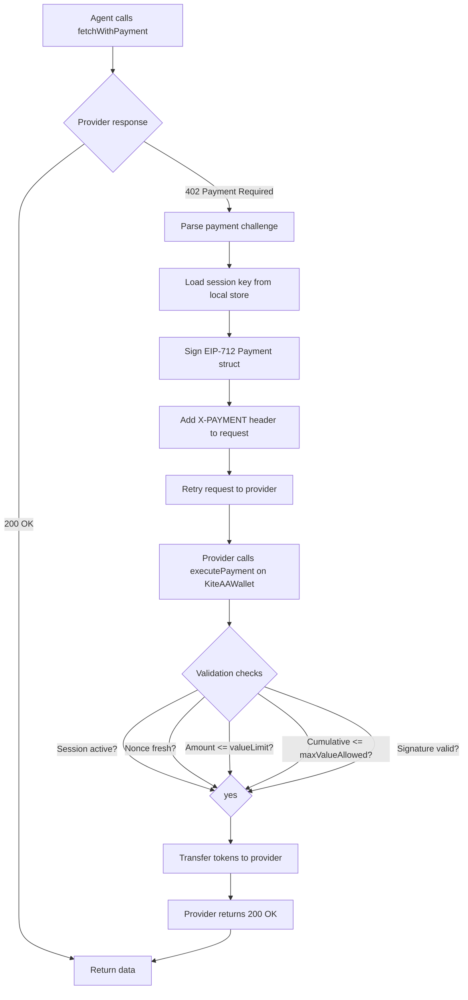
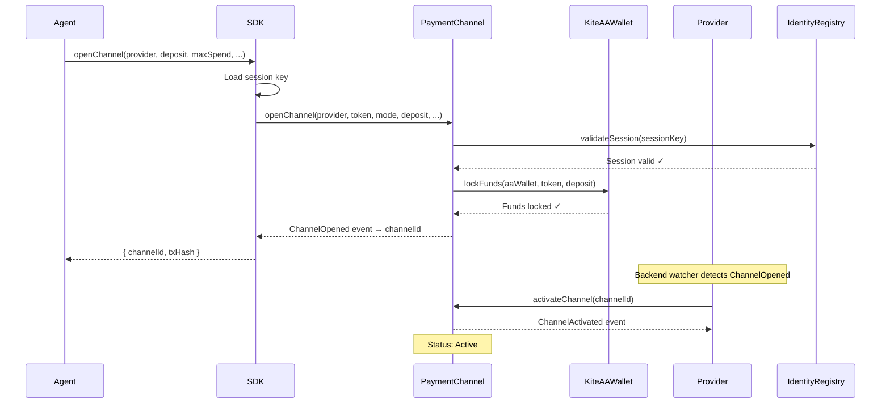
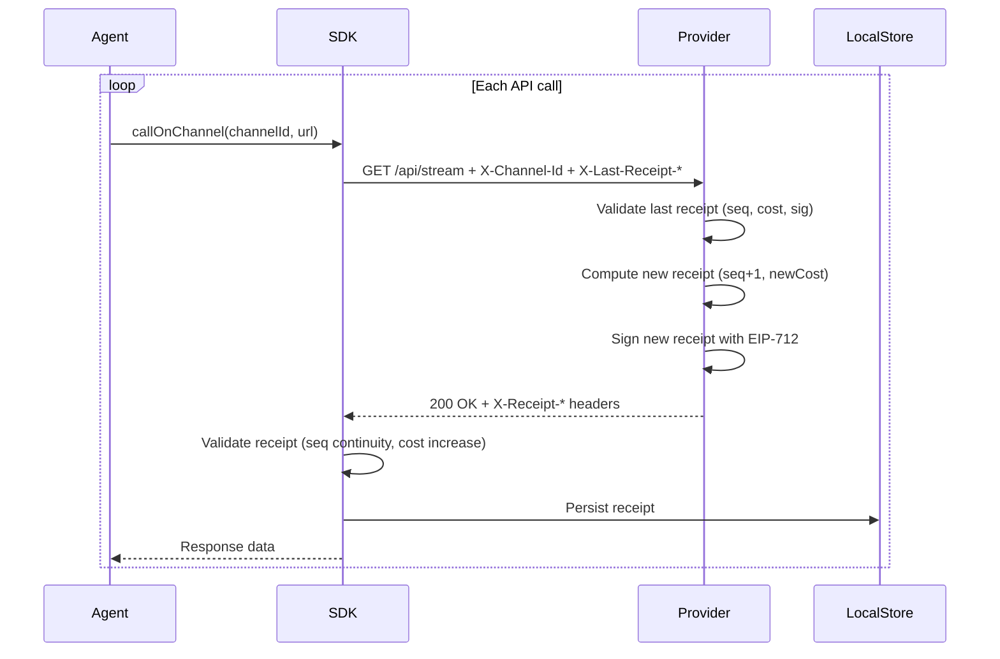
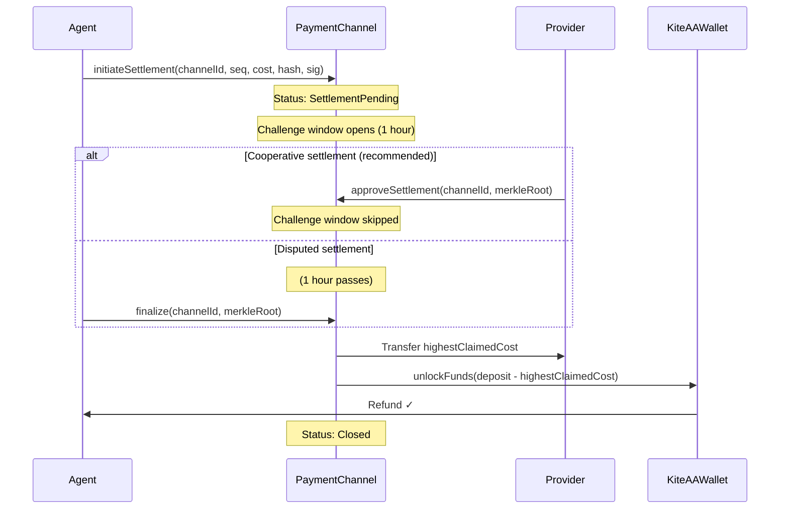

# Payment Flow

## Per-Call (x402) Flow

The simplest payment model. Each API call carries a fresh signed receipt.

**Gas cost:** One on-chain transaction per API call (`executePayment`).

---

## Channel Open Flow

Opening a payment channel pre-funds the session and sets terms.

**Gas cost:** Two on-chain transactions (one by consumer: `openChannel`, one by provider: `activateChannel`).

---

## Receipt Accumulation Flow

Once a channel is active, calls accumulate off-chain receipts.

**Gas cost:** Zero — all receipt exchange is off-chain.

**Receipts are cumulative:** Receipt at `seq=10` covers the cost of calls 1–10. Only the last receipt matters for settlement.

---

## Settlement Flow

Either party initiates settlement. The contract verifies the highest submitted receipt.

**Gas cost:** 1–2 transactions (initiate + finalize, or single `approveSettlement`).

---

## Full Channel Lifecycle Summary

| Phase | Who acts | Gas? | What happens |
|---|---|---|---|
| Open | Consumer (agent) | Yes | Locks deposit, sets channel terms |
| Activate | Provider | Yes | Acknowledges channel, enables calls |
| Calls | Off-chain | No | Provider signs receipts, consumer persists them |
| Initiate settlement | Consumer or provider | Yes | Submits last receipt, starts challenge window |
| Approve settlement | Provider | Yes | Cooperative close (skips challenge) |
| Finalize | Anyone | Yes | After challenge window; distributes funds |

---

## Gas Cost Comparison

| Scenario | x402 | Channel |
|---|---|---|
| 1 call | 1 tx | 3 tx (open + activate + settle) |
| 5 calls | 5 tx | 3 tx |
| 10 calls | 10 tx | 3 tx |
| 100 calls | 100 tx | 3 tx |
| 1000 calls | 1000 tx | 3 tx |

Channels pay fixed overhead regardless of call count. Break-even is around 3–5 calls depending on gas prices.

---

## Related Pages

- [x402 Payments →](../concepts/x402-payments) — Deep dive on per-call payment
- [Payment Channels →](../concepts/payment-channels) — Channel concepts and types
- [Channel Settlement →](../channels/settlement) — Settlement mechanics in detail
- [Demo 3: Batch Flow →](../simulations/batch-flow)
- [Demo 5: Channel Settlement →](../simulations/recovery)
