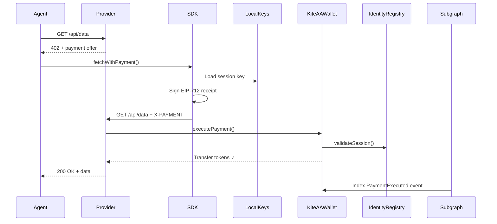
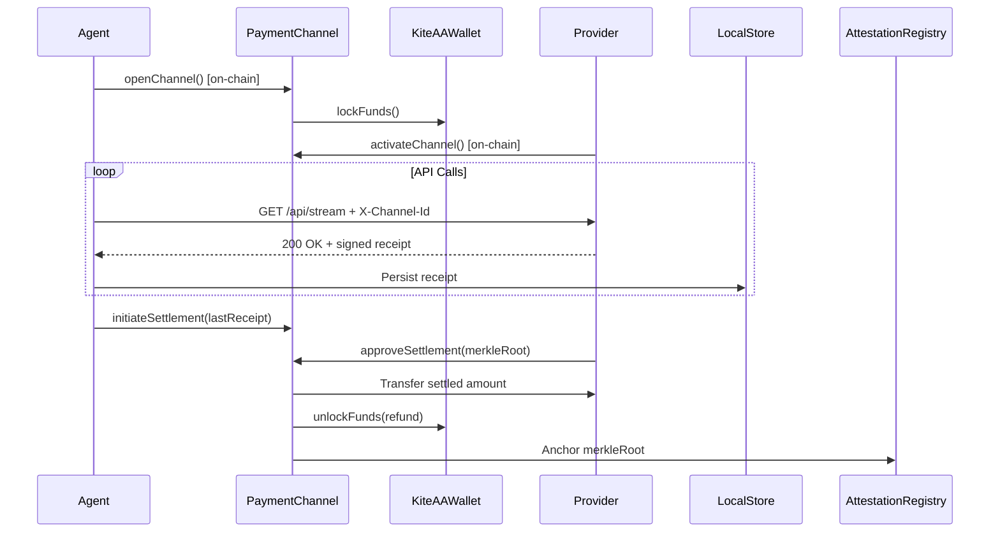

# System Overview

## Component Map

```
┌─────────────────────────────────────────────────────────────────┐
│                        User / Developer                         │
│              EOA (MetaMask / hardware wallet)                   │
└────────────┬────────────────────────────────────────────────────┘
             │
             │ kite init / kite onboard
             ▼
┌─────────────────────────────────────────────────────────────────┐
│                    Local Machine                                │
│   ~/.kite-agent-pay/config.json  (EOA credential)              │
│   ~/.kite-agent-pay/vars.json    (session keys, agent IDs)     │
│   ~/.kite-agent-pay/channels/    (channel state + receipts)    │
│                                                                 │
│   ┌──────────────┐    ┌────────────────────────────────────┐  │
│   │   Kite CLI   │    │    Kite MCP Server (kite-mcp)      │  │
│   │  (npx kite)  │    │    Port 3100 — SSE / HTTP MCP      │  │
│   └──────┬───────┘    └──────────────────┬─────────────────┘  │
│          │                               │                      │
│          └──────────────┬────────────────┘                      │
│                         ▼                                        │
│              ┌─────────────────────┐                           │
│              │  @kite-agentic-pay/ │                           │
│              │       sdk           │                           │
│              │  KiteSettleClient   │                           │
│              └──────────┬──────────┘                           │
└─────────────────────────┼───────────────────────────────────────┘
                          │ on-chain calls + subgraph queries
                          │
          ┌───────────────┴───────────────────────────────┐
          │                                               │
          ▼                                               ▼
┌─────────────────────┐                    ┌─────────────────────┐
│   Kite AI Testnet   │                    │  Subgraph Indexer   │
│   Chain ID: 2368    │                    │  (Goldsky hosted)   │
│                     │                    │  GraphQL API        │
│  IdentityRegistry   │ ←── events ──────► │  Entities:          │
│  KiteAAWallet       │                    │  - Agent            │
│  PaymentChannel     │                    │  - Session          │
│  AttestationReg.    │                    │  - Channel          │
└─────────────────────┘                    │  - Payment          │
          ▲                                └─────────────────────┘
          │ payments validated on-chain
          │
┌─────────────────────┐
│  Provider Backend   │
│  (backend/)         │
│  Port 4000          │
│                     │
│  /api/data/*  x402  │
│  /api/stream/* chan  │
│  /api/flex/*  both  │
└─────────────────────┘
```

---

## Component Responsibilities

### SDK (`mcp-sdk/`)

The core library. Every other component — CLI, MCP server, demos — uses the SDK internally.

**Key class:** `KiteSettleClient`

**Responsibilities:**

- Derive AA wallets from EOA credentials
- Register agents on `IdentityRegistry`
- Generate and manage session keys
- Sign EIP-712 payment receipts
- Execute x402 per-call payments
- Open, call through, and settle payment channels
- Persist channel state and receipts locally
- Query the subgraph for history

### CLI (`npx kite`)

A developer-facing command-line interface for setup, management, and testing.

**Key commands:** `init`, `onboard`, `whoami`, `call`, `channel`, `session`, `balance`

### MCP Server (`kite-mcp/`)

A thin server that exposes SDK capabilities as MCP tools for AI runtimes.

**Port:** 3100
**Transports:** SSE (`/mcp/sse`), POST (`/mcp/messages`), Streamable HTTP (`/mcp`)

### Backend Provider (`backend/`)

A reference implementation of a service provider that accepts Kite payments. Not a production service — a simulation that accurately demonstrates all provider-side integration patterns.

**Port:** 4000
**Three payment models:** x402, channel, flex (both)

### Smart Contracts (`contracts/`)

Four Solidity contracts deployed on Kite AI Testnet (Chain ID 2368):

| Contract            | Address           | Role                            |
| ------------------- | ----------------- | ------------------------------- |
| IdentityRegistry    | `0xE4C30627...`   | Agent NFTs, session keys        |
| KiteAAWallet        | (deploy-specific) | Fund custody, payment execution |
| PaymentChannel      | `0x8EC6B059...`   | Batch/stream channel lifecycle  |
| AttestationRegistry | `0x2F72b719...`   | Reputation, Merkle anchors      |

### Subgraph (`subgraph/`)

A The Graph / Goldsky subgraph that indexes all contract events into a queryable GraphQL API.

**Indexed contracts:** IdentityRegistry, PaymentChannel, AttestationRegistry
**Dynamic templates:** ClientVault (per AA wallet)

---

## Data Flow

### x402 Per-Call Payment



### Channel Payment



---

## Network Configuration

| Parameter     | Value                                               |
| ------------- | --------------------------------------------------- |
| Chain name    | Kite AI Testnet                                     |
| Chain ID      | `2368`                                              |
| RPC URL       | `https://rpc-testnet.gokite.ai`                     |
| Bundler URL   | `https://bundler-service.staging.gokite.ai/rpc/`    |
| Explorer      | `https://testnet-explorer.gokite.ai`                |
| Default token | DmUSDT `0xd4a87d5531A586C247BD13F3Bb0Dd68C6253B489` |

---

## Related Pages

- [Payment Flow →](./payment-flow) — Detailed flow diagrams for each payment model
- [Session Runtime →](./session-runtime) — How session loading and MCP binding work
- [Indexer Sync →](./indexer-sync) — Local state vs subgraph consistency
