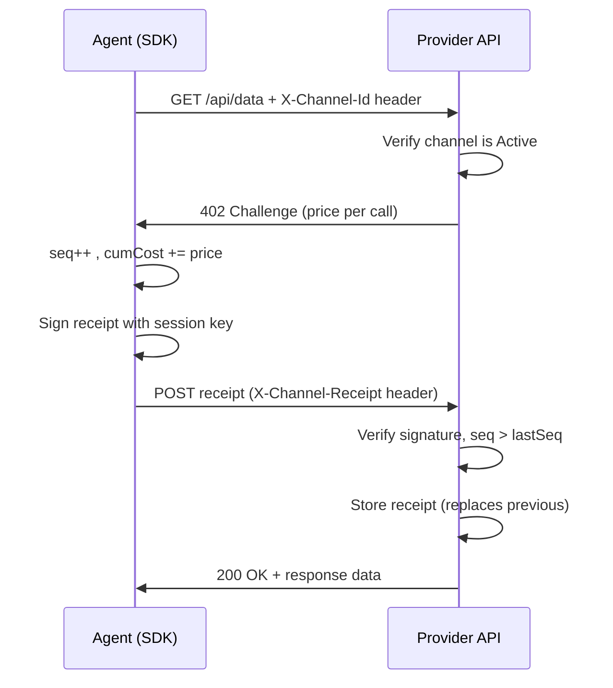

# Channel Receipts

Receipts are the off-chain payment mechanism inside a channel. Every API call within a channel produces a receipt — a signed message that proves cumulative payment.

## Receipt Structure

```typescript
type ChannelReceipt = {
  channelId: `0x${string}`;       // The channel this receipt belongs to
  sequenceNumber: bigint;          // Monotonically increasing call count
  cumulativeCost: bigint;          // Total paid so far in this channel (wei)
  callData?: string;               // Optional: hash of the API request
  signature: `0x${string}`;       // EIP-712 signature from the session key
};
```

## Why Cumulative?

Receipts are **cumulative**, not per-call. Receipt #5 doesn't say "pay 0.40 USDT for this call" — it says "total amount owed is 2.00 USDT (5 calls × 0.40 each)".

This design makes dispute resolution simple: the provider only needs to submit the *highest* sequence number receipt to settle. All earlier receipts are implicitly covered.

```
Receipt #1: cumulativeCost = 0.40 USDT
Receipt #2: cumulativeCost = 0.80 USDT
Receipt #3: cumulativeCost = 1.20 USDT
    ...
Receipt #5: cumulativeCost = 2.00 USDT  ← this is all the provider needs to settle
```

## Receipt Flow Per Call



## EIP-712 Signing

Receipts are signed using EIP-712:

```typescript
const domain = {
  name: "KitePaymentChannel",
  version: "1",
  chainId: 2368,
  verifyingContract: PAYMENT_CHANNEL_CONTRACT,
};

const types = {
  Receipt: [
    { name: "channelId", type: "bytes32" },
    { name: "sequenceNumber", type: "uint256" },
    { name: "cumulativeCost", type: "uint256" },
  ],
};

const receipt = {
  channelId: channel.channelId,
  sequenceNumber: BigInt(5),
  cumulativeCost: parseUnits("2.00", 18),
};

const signature = await sessionKey.signTypedData({ domain, types, primaryType: "Receipt", message: receipt });
```

## Local Receipt Store

The SDK automatically persists every receipt to disk before returning:

```
~/.kite-agent-pay/
└── channels/
    └── 0xabc123.../
        ├── meta.json         ← channel open info
        └── receipts.json     ← array of all receipts
```

The provider also keeps a copy. If your local copy is lost, the provider's copy is the source of truth.

## Sequence Number Enforcement

The provider enforces:
- `sequenceNumber` must be strictly greater than the previous receipt's `sequenceNumber`
- `cumulativeCost` must be greater than or equal to the previous receipt's `cumulativeCost`
- Signature must verify against the session key registered for this channel

If any check fails, the call is rejected without being served.

## Reading Local Receipts

```typescript
import { ChannelStore } from "@kite-agentic-pay/sdk";

const store = new ChannelStore();
const receipts = store.getReceipts(channelId);
const last = store.getLastReceipt(channelId);

console.log(`${receipts.length} calls, ${formatUnits(last.cumulativeCost, 18)} USDT total`);
```

## Related Pages

- [Channel Settlement →](./settlement) — Using receipts to settle
- [Channel Recovery →](./recovery) — If receipt copies are lost
- [Local Store →](./local-store) — File locations and backup guidance
