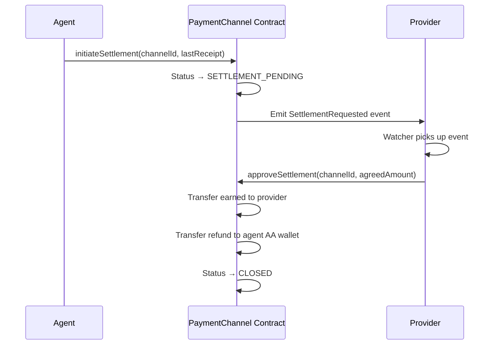

# Channel Settlement

Settlement is the process of closing a channel and distributing funds: the provider receives the earned amount, and the agent gets the unused deposit back.

## Cooperative Settlement (Happy Path)



Both parties get their funds in a single round — no challenge window required.

## Starting Settlement

```bash
# CLI
npx kite channel close --channel 0xabc123...

# SDK
await client.initiateSettlement(channelId);
```

The SDK automatically uses the highest local receipt as the settlement proof.

## Force Finalization (Disputed or Unresponsive Provider)

If the provider does not call `approveSettlement` within the challenge window (default: 1 hour):

```bash
# CLI (after challenge window)
npx kite channel force-close --channel 0xabc123...

# SDK
await client.finalizeChannel(channelId);
```

This pays the provider based on the highest receipt they submitted during the challenge window. If they submitted nothing, the full deposit is refunded to the agent.

## Checking Status After Settlement

```typescript
const info = await client.getChannelInfo(channelId);
console.log(info.status);          // "CLOSED"
console.log(info.settledAmount);   // Amount paid to provider
console.log(info.refundAmount);    // Amount refunded to agent
```

## Settlement Timing

| Step | Who | Timing |
|---|---|---|
| `initiateSettlement` | Agent | Any time after channel is Active |
| `approveSettlement` | Provider | Within challenge window (1h) |
| `finalizeChannel` | Either party | After challenge window if no approval |

## Batch Settlement (multiple channels)

```typescript
const channels = await client.getChannelsByAgent("1");
const open = channels.filter(c => c.status === "Active");

for (const ch of open) {
  await client.initiateSettlement(ch.channelId);
  console.log(`Settled channel ${ch.channelId}`);
}
```

## What Happens to Unused Deposit?

After settlement, the difference between `deposit` and `settledAmount` is transferred back to your AA wallet:

```
deposit = 5.00 USDT
used    = 2.00 USDT (5 calls × 0.40 each)
refund  = 3.00 USDT → returned to AA wallet automatically
```

## Related Pages

- [Channel Receipts →](./receipts) — What gets submitted during settlement
- [Channel Recovery →](./recovery) — When settlement can't proceed normally
- [PaymentChannel Contract →](../smart-contracts/payment-channel) — On-chain mechanics
