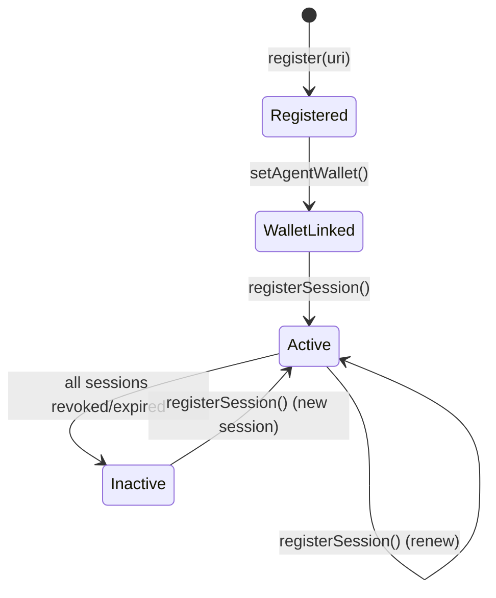

# Agent Identity

## What Is an Agent Identity?

In Kite Agentic Pay, every AI agent has a **persistent on-chain identity** — not a username, not an API key, but an NFT on the `IdentityRegistry` contract.

Each agent is represented by an ERC-721 token called an **agentId** (the token ID). This agentId is the agent's canonical identity across the entire protocol.

:::info EIP-8004
The identity model is inspired by [EIP-8004](https://eips.ethereum.org/EIPS/eip-8004), a proposed standard for on-chain agent identity registries. It defines how agents register, link session keys, and express metadata.
:::

---

## The Three-Layer Identity Model

```
EOA (User)
 └── AA Wallet (GokiteAccount)
      └── Agent NFT (agentId)
           └── Session Key(s)
```

These are four distinct things:

| Layer | What it is | What it controls |
|---|---|---|
| **EOA** | Your externally owned account (MetaMask, hardware wallet) | Fund ownership, agent registration |
| **AA Wallet** | Smart contract wallet (GokiteAccount) | Fund custody, payment execution |
| **Agent NFT** | ERC-721 on `IdentityRegistry` | Agent identity, session delegation |
| **Session Key** | Ephemeral signing key | Bounded autonomous spending |

**Critical distinction:**
- `agentId ≠ wallet address` — the agent NFT is not the AA wallet
- `agentId ≠ session key` — the session key is attached to the agent, not the agent itself
- Multiple runtimes can share one `agentId` (one Claude instance, one OpenAI instance, etc.)
- Multiple `agentId`s can share one AA wallet

---

## Agent Metadata (ERC-8004 URI)

When you mint an agent, you provide a `registrationURI` — a JSON document that describes the agent:

```json
{
  "name": "Kite Demo Agent",
  "description": "Onboarding demo agent created by kite-agentic-pay.",
  "version": "1.0.0",
  "capabilities": ["data-fetch", "payment"],
  "category": "analytics"
}
```

This can be hosted on IPFS, a regular HTTPS URL, or embedded as a data URI. The URI is stored on-chain and can be updated by the agent owner.

---

## The Agent Wallet Link

After registration, the agent is linked to an AA wallet:

```solidity
setAgentWallet(agentId, walletContract, user, deadline, sig)
```

This link tells the protocol: *"payments made by agent `agentId` should debit the wallet at `walletContract`, from the balance owned by `user` (EOA)."*

This separation is important — a multi-tenant AA wallet can hold funds for multiple EOAs, and each agent link specifies exactly which user's balance to charge.

---

## Agent Lifecycle



---

## Ownership and Portability

The `agentId` is an **ERC-721 NFT**. This means:
- It can be transferred to a new EOA owner
- It can be listed on NFT marketplaces (in theory)
- Ownership is permissionlessly verifiable on-chain
- No registration authority can revoke it

The EOA that minted the agent is the initial owner. Only the owner (or an approved operator) can update the metadata URI or register new session keys.

---

## Runtime Bindings

One of the strongest features of the identity model is that **runtimes can be swapped without changing identity**.

If you run Claude Desktop with a Kite session key today, and switch to a LangChain agent tomorrow, both share the same `agentId`. Providers see the same agent identity. Payment history is attributed to the same agent. Reputation accumulates on the same on-chain record.

This is impossible with API keys — every runtime gets a different key, and there is no unified identity across runtimes.

---

## How to Register an Agent

### CLI

```bash
npx kite onboard --name "My Agent" --category analytics
```

### SDK

```typescript
import { KiteSettleClient } from "@kite-agentic-pay/sdk";

const client = await KiteSettleClient.create({ credential });
const result = await client.onboard({
  agentURI: JSON.stringify({ name: "My Agent", version: "1.0" }),
  validDays: 30,
  sessionRule: {
    timeWindow: 86400n,
    budget: parseUnits("10.0", 18),
  },
});

console.log(result.agentId);        // e.g. "1"
console.log(result.aaWalletAddress); // GokiteAccount address
console.log(result.sessionKeyAddress); // Session key used for signing
```

---

## Related Concepts

- [Session Keys →](./session-keys) — How agents sign payments within spending limits
- [Local-First Architecture →](./local-first-architecture) — Where identity data is stored locally
- [IdentityRegistry Contract →](../smart-contracts/identity-registry) — Full contract reference
