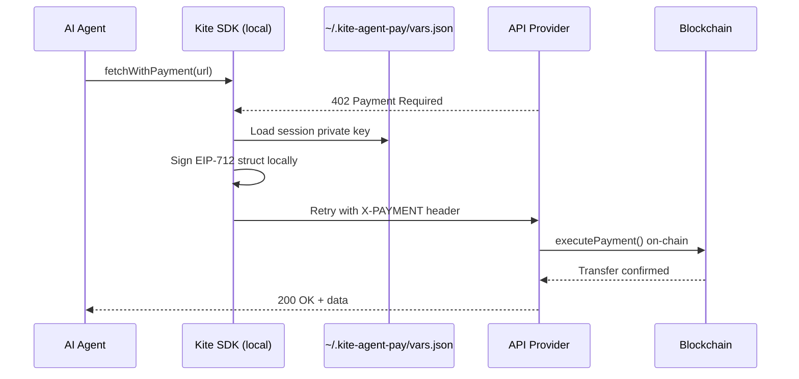

# Local-First Architecture

## The Core Principle

**Local-first** means the signing stack runs on your machine, not on a remote server.

In Kite Agentic Pay:

- Session private keys are stored at `~/.kite-agent-pay/vars.json` on your machine
- Channel state and receipts are persisted locally before any on-chain sync
- The subgraph indexer is optional — it exists for observability, not for operation
- No Kite server holds your credentials or can sign on your behalf

This is a deliberate architectural choice, not a limitation.

---

## What Lives Locally

| Data                      | Location                                    | Set by                               |
| ------------------------- | ------------------------------------------- | ------------------------------------ |
| EOA credential (seed/key) | `~/.kite-agent-pay/config.json`             | `kite init`                          |
| Agent IDs, session keys   | `~/.kite-agent-pay/vars.json`               | `kite onboard`, `kite session start` |
| Channel state             | `~/.kite-agent-pay/channels/`               | SDK (automatic)                      |
| Unsigned receipts         | `~/.kite-agent-pay/channels/<id>/receipts/` | SDK (automatic)                      |

All files are created with mode `0600` (owner read/write only).

---

## Why Local-First Matters

### The Alternative: Remote Signing Server

The alternative architecture has a remote server that:

1. Holds your session private key in a cloud HSM or encrypted secret store
2. Signs payment receipts when your agent requests them
3. Returns signed receipts to your agent via API

This is convenient but introduces:

| Risk                     | Description                                                           |
| ------------------------ | --------------------------------------------------------------------- |
| **Server compromise**    | If the signing server is breached, all session keys are exposed       |
| **Service availability** | If the server goes down, your agent cannot make payments              |
| **Privacy**              | The server sees all your payment requests and can log them            |
| **Vendor lock-in**       | You depend on a specific provider for your agent's payment capability |
| **Trust requirement**    | You must trust the server operator not to misuse your keys            |

### The Local-First Advantage

With local signing:

- If Kite's infrastructure goes offline, your agent keeps working
- Nobody sees your session keys except your machine
- You can inspect, backup, or migrate your session keys at any time
- The signing code is open-source and auditable

---

## How It Works in Practice

When your agent makes an API call through the SDK:



No remote server is involved in the signing step. The session key never leaves the machine.

---

## Channel State Is Local-First

For payment channels, the SDK maintains local state that is more up-to-date than the on-chain state:

```
Local channel store                On-chain state
─────────────────────              ───────────────
channelId: 0xabc...                channelId: 0xabc...
status: Active                     status: Active
lastSeq: 47                        (no seq tracking on-chain)
lastCumulativeCost: 9.4 USDT       (no cumulative tracking on-chain)
receipts: [seq1..seq47]            usageMerkleRoot: (only at settlement)
```

The on-chain contract only knows the channel parameters and the current status. The detailed receipt history lives locally. This is:

- **More efficient** — no gas cost for each receipt
- **More private** — call-by-call costs are not on-chain
- **Resilient** — local state survives RPC outages during a session

---

## Recovery

If local state is lost, recovery options depend on what was lost:

| Lost data                        | Recovery path                                                                 |
| -------------------------------- | ----------------------------------------------------------------------------- |
| `config.json` (EOA credential)   | Re-enter from seed phrase/key                                                 |
| `vars.json` (agent/session keys) | Re-query IdentityRegistry on-chain, re-derive or re-register session          |
| Channel receipts                 | Query subgraph for last anchored receipt; cannot recover un-anchored receipts |

:::warning
If you lose local channel receipts and the provider has a higher sequence receipt than you, the provider can submit their receipt during the challenge window. Always back up `~/.kite-agent-pay/`.
:::

---

## The Indexer Is Secondary

The subgraph indexer provides:

- Historical payment queries
- Cross-device agent state synchronization
- Observability dashboards
- Merkle proof verification

But it is **not required for operation**. The SDK can function entirely from local state and direct on-chain reads. The indexer enriches the experience — it does not gate it.

---

## Tradeoffs

Local-first is a design choice with real tradeoffs. See [Security Tradeoffs →](../security/tradeoffs) for an honest assessment of where this model falls short.

Short version:

- If your machine is compromised, your session keys may be exposed (but the damage is bounded by session limits)
- Local-only operation means no cross-device synchronization without the indexer
- Recovery from a lost machine requires re-onboarding (new session keys)

---

## Related Concepts

- [Session Keys →](./session-keys) — What is stored locally and why
- [Channel Local Store →](../channels/local-store) — Receipt persistence details
- [Security Tradeoffs →](../security/tradeoffs) — Honest assessment of local-first limits
- [Indexer Sync →](../architecture/indexer-sync) — How the subgraph relates to local state
