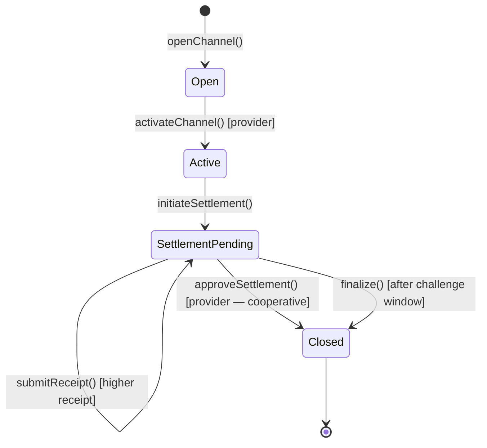
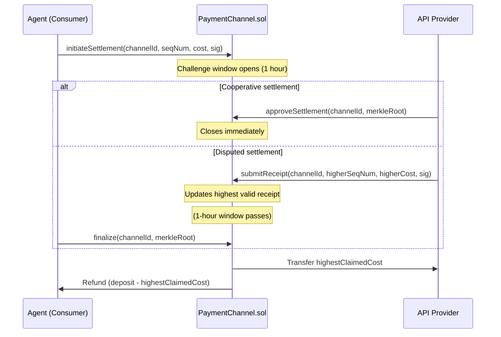

# Payment Channels

## What Are Payment Channels?

Payment channels let a consumer (agent) and a provider agree to exchange many API calls off-chain, accumulating signed receipts, and settle the aggregate cost in a **single on-chain transaction** at the end.

This is the key efficiency improvement over x402 per-call payments:

| Model | On-chain transactions for 100 calls |
|---|---|
| x402 per-call | 100 |
| Payment channel | 2 (open + close) |

---

## Channel Types

Kite supports two channel variants:

### Batch Channel

Bounded by **maximum call count** (`maxCalls`). The consumer deposits funds and makes up to N calls. Settlement happens when:
- The consumer initiates settlement after all calls are done
- The provider initiates settlement
- The `maxDuration` timeout expires

Best for: grouped workflows, known call counts, batch data fetches.

### Stream Channel

Bounded by **duration** (`maxDuration`) plus optionally by call count. The channel auto-closes when the time window expires.

Best for: monitoring feeds, recurring tasks, market data subscriptions, long-running workflows.

---

## The Payment Channel Lifecycle



---

## How Receipts Work

Every API call through a channel produces a **signed receipt**. Each receipt is cumulative:

```json
{
  "channelId": "0xabc...",
  "sequenceNumber": 5,
  "cumulativeCost": "1000000000000000000",
  "receiptHash": "0xdef...",
  "providerSignature": "0x..."
}
```

- `sequenceNumber` is monotonically increasing — gaps are not allowed
- `cumulativeCost` covers all calls from 1 through `sequenceNumber`
- The provider signs each receipt using EIP-712

At settlement, only the **last** receipt matters. The contract compares all submitted receipts and settles based on the highest valid one.

---

## Settlement Mechanics



### Cooperative Settlement (Recommended)

The provider calls `approveSettlement()` immediately, skipping the challenge window. The channel closes instantly with:
- Provider receives the claimed amount
- Consumer gets refund of unused deposit

This is the path used in Demo 5 and in the backend's settlement watcher.

### Challenge-Based Settlement

If the cooperative path is not available, either party can `finalize()` after the 1-hour challenge window. During the window, **anyone** can submit a higher valid receipt to dispute the claimed amount.

---

## Local Receipt Storage

:::warning Critical
Receipts must be stored locally. If the consumer loses their receipts, they cannot prove the sequence of calls and may be unable to dispute an incorrect settlement.
:::

The SDK automatically stores all receipts in the local channel store (`~/.kite-agent-pay/channels/`). Each receipt is persisted before the next API call begins.

See [Channel Local Store →](../channels/local-store) for details.

---

## Opening a Channel

### SDK

```typescript
const channel = await client.openChannel({
  provider: "0xProviderAddress...",
  token: DM_USDT_TOKEN,
  deposit: parseUnits("5.0", 18),    // 5 USDT pre-funded
  maxSpend: parseUnits("4.5", 18),   // max 4.5 USDT total
  maxDuration: 3600,                  // 1 hour
  maxPerCall: parseUnits("0.5", 18), // max 0.5 USDT per call
  mode: "prepaid",
});

console.log(channel.channelId);
```

### CLI

```bash
npx kite channel open \
  --provider 0xProvider... \
  --deposit 5 \
  --max-calls 10 \
  --duration 3600
```

---

## Making Calls on a Channel

```typescript
const response = await client.callOnChannel(
  channel.channelId,
  "http://localhost:4000/api/stream/intelligence",
  { method: "GET" }
);
```

The SDK automatically:
1. Sends `X-Channel-Id` and `X-Last-Receipt-*` headers
2. Receives and validates the provider's new receipt
3. Persists the receipt locally
4. Returns the API response

---

## Settling a Channel

```typescript
await client.initiateSettlement(channel.channelId);
```

This submits the last known receipt on-chain and starts the challenge window. If the provider runs the settlement watcher (as the reference backend does), it will call `approveSettlement()` automatically.

---

## x402 vs Batch vs Stream — Decision Guide

| Criterion | x402 | Batch | Stream |
|---|---|---|---|
| **Call count known?** | Any | Yes (bounded) | No (time-based) |
| **Duration known?** | N/A | Optional | Yes |
| **Gas efficiency** | Low | High | High |
| **Setup required** | None | Open channel | Open channel |
| **Recovery on failure** | None needed | Local receipts | Local receipts |
| **Best for** | One-off calls | Grouped workflows | Real-time feeds |

---

## Related Concepts

- [x402 Payments →](./x402-payments) — The per-call alternative
- [Channel Opening →](../channels/opening) — Step-by-step channel setup
- [Channel Settlement →](../channels/settlement) — Settlement mechanics in detail
- [Channel Recovery →](../channels/recovery) — What to do if a channel fails
- [PaymentChannel Contract →](../smart-contracts/payment-channel) — Smart contract reference
- [Demo 3: Batch Flow →](../simulations/batch-flow) — Live demo
- [Demo 4: Stream Flow →](../simulations/stream-flow) — Live demo
