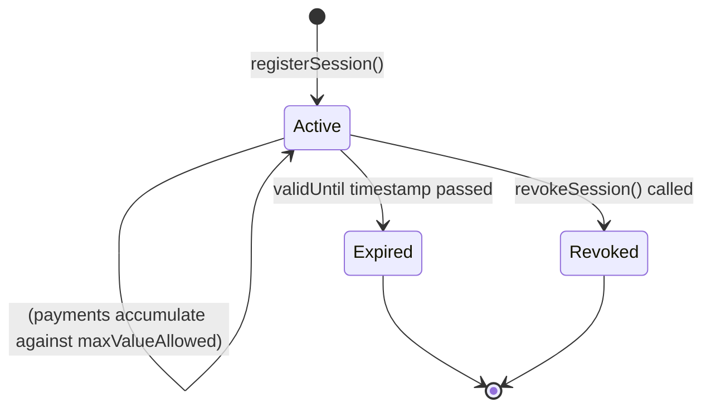

# Session Keys

## What Is a Session Key?

A **session key** is a temporary, delegated signing key that an agent uses to authorize payments without requiring the EOA owner to sign every transaction.

Think of it as a **bounded power of attorney** for your agent:
- The agent can spend funds — but only up to a configured limit
- The agent can make calls — but only until the key expires
- The agent can be revoked — without moving funds to a new address

---

## Why Not Just Use the EOA?

This is the most common question. The answer has several parts:

**1. Unlimited spending risk.** If the agent has your EOA key, it has unlimited access to all your funds. A bug, a malicious provider, or a compromised runtime means total loss.

**2. No revocation path.** You cannot revoke an EOA key without moving all funds to a new address. With a session key, you just call `revokeSession()`.

**3. Key exposure surface.** EOA keys are used everywhere — hardware wallets, MetaMask, exchange accounts. Giving the key to an agent runtime (which might be Claude Desktop, a cloud VM, or a GitHub Action) massively expands the attack surface.

**4. No auditability.** An EOA key has no concept of "this payment was made by the analytics agent within a 10 USDT session budget." Session keys create scoped, attributable spend records.

---

## Session Key Structure

A session key has the following on-chain parameters (stored in `IdentityRegistry`):

| Field | Type | Description |
|---|---|---|
| `agentId` | uint256 | Which agent this session belongs to |
| `user` | address | EOA owner whose balance is debited |
| `walletContract` | address | AA wallet holding the funds |
| `validUntil` | uint256 | Unix timestamp expiry |
| `valueLimit` | uint256 | Maximum spend per single transaction |
| `maxValueAllowed` | uint256 | Total session budget (lifetime cap) |
| `blockedAgents` | uint256[] | Agent IDs this session cannot interact with |

---

## Session Lifecycle



Sessions cannot be renewed — when they expire or are revoked, a new session must be registered. This is intentional: it provides a natural security reset point.

---

## How Sessions Are Created

### CLI

```bash
npx kite onboard    # creates a session as part of full onboarding
npx kite session start --agent 1 --days 30 --budget 100
```

### SDK

```typescript
const result = await client.onboard({
  agentURI: "...",
  validDays: 30,
  sessionRule: {
    timeWindow: 86400n,        // 1 day rate-limit window
    budget: parseUnits("10", 18),  // 10 USDT total budget
  },
});

// session key is now stored in ~/.kite-agent-pay/vars.json
// and registered on IdentityRegistry on-chain
```

Session keys are stored locally at `~/.kite-agent-pay/vars.json` under the key `SESSION_<agentId>_<index>_PRIVATE`.

---

## How Sessions Authorize Payments

For **x402 per-call payments**, the session key signs an EIP-712 struct:

```solidity
Payment(
  uint256 agentId,
  address sessionKey,
  address recipient,
  address token,
  uint256 amount,
  uint256 nonce,
  uint256 deadline
)
```

This signature is placed in the `X-PAYMENT` header. The `KiteAAWallet` contract verifies:
1. The session key is active and not expired
2. The nonce has not been used (replay protection)
3. The deadline has not passed
4. The amount is within `valueLimit`
5. The cumulative session spend is within `maxValueAllowed`
6. The recipient is not blocklisted

For **payment channels**, the session key signs channel-open transactions and individual receipts. The channel contract validates the session through `IdentityRegistry`.

---

## Threat Model

| Threat | Mitigation |
|---|---|
| Session key stolen | Attacker can spend at most `maxValueAllowed` before the budget is exhausted. Revoke immediately with `npx kite session revoke`. |
| Runtime compromise | Same as above — bounded by session budget, not total wallet balance |
| Nonce replay attack | On-chain bitmap nonce tracking prevents replaying any signed receipt |
| Provider overbilling | Per-call `valueLimit` cap — provider cannot charge more than configured per call |
| Session never expires | `validUntil` is enforced on-chain — the contract rejects expired sessions |

---

## Revoking a Session

```bash
npx kite session revoke --key 0x875...
```

Or via SDK:

```typescript
await client.revokeSession(sessionKeyAddress);
```

Revocation is immediate — the contract sets `sessions[key].status = Revoked`. Any in-flight signed receipts using that key will be rejected on-chain after the revocation transaction is confirmed.

---

## Multiple Sessions

One agent can have multiple active session keys — for example:
- One session key for Claude Desktop (shorter expiry, lower budget)
- One session key for a background automation (longer expiry, higher budget)
- One session key for a specific provider integration

All sessions share the same `agentId` and AA wallet, but each has independent spending limits and revocation.

---

## Related Concepts

- [Agent Identity →](./agent-identity) — How agents are registered before sessions are created
- [x402 Payments →](./x402-payments) — How session keys sign payment receipts
- [Security: Session Security →](../security/session-security) — Encryption and isolation details
- [KiteAAWallet Contract →](../smart-contracts/kite-aa-wallet) — On-chain session validation
