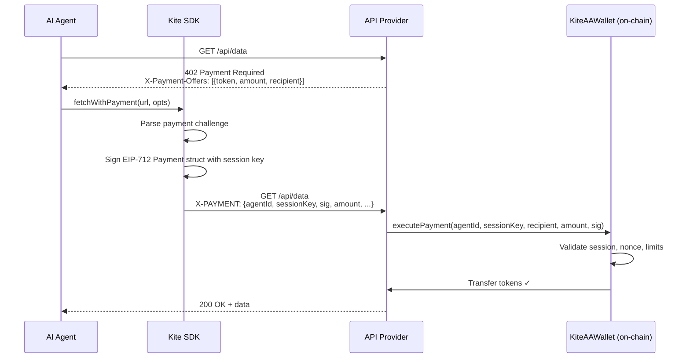

# x402 Payments

## What Is x402?

x402 is a payment protocol built on HTTP's `402 Payment Required` status code. When a client makes a request to a paid API endpoint, the server responds with `402` and a payment challenge. The client pays, attaches proof in the request header, and retries — the server then returns the actual response.

Kite implements x402 using **EIP-712 signed receipts** settled through the `KiteAAWallet` contract. No separate payment processor is needed — the provider validates and settles directly on-chain.

---

## The x402 Flow



---

## The Payment Challenge

When the provider returns `402`, the response body contains a payment offer:

```json
{
  "accepts": [
    {
      "payTo": "0xProviderAddress...",
      "maxAmountRequired": "400000000000000000",
      "asset": "0xd4a87d5531A586C247BD13F3Bb0Dd68C6253B489",
      "network": "kite-ai-testnet"
    }
  ]
}
```

The SDK parses this, creates the EIP-712 payment struct, signs it with the session key, and adds it to the retry request.

---

## The EIP-712 Payment Struct

```solidity
Payment(
  uint256 agentId,
  address sessionKey,
  address recipient,
  address token,
  uint256 amount,
  uint256 nonce,
  uint256 deadline
)
```

The session key signs this struct. The resulting signature is bundled into the `X-PAYMENT` header as a JSON blob:

```json
{
  "agentId": "1",
  "sessionKey": "0x875...",
  "recipient": "0xProvider...",
  "token": "0xDmUSDT...",
  "amount": "400000000000000000",
  "nonce": "42",
  "deadline": "1748000000",
  "signature": "0xabc..."
}
```

---

## On-Chain Validation

The provider calls `KiteAAWallet.executePayment()` with the header data. The contract validates:

1. **Session is active** — delegates to `IdentityRegistry.validateSession(sessionKey)`
2. **Not expired** — `deadline > block.timestamp`
3. **Nonce is fresh** — bitmap nonce tracker, prevents replay attacks
4. **Amount within per-call limit** — `amount <= session.valueLimit`
5. **Cumulative spend within budget** — `totalSpent + amount <= session.maxValueAllowed`
6. **Signature is valid** — EIP-712 signature matches `sessionKey`
7. **Recipient not blocklisted** — checks session's `blockedAgents` list

If all checks pass, tokens are transferred from the AA wallet to the provider.

---

## Using x402 in the SDK

### Drop-in replacement for `fetch`

```typescript
import { KiteSettleClient } from "@kite-agentic-pay/sdk";

const client = await KiteSettleClient.create({ credential });

// Same API as fetch — just handles 402 automatically
const response = await client.fetchWithPayment(
  "http://localhost:4000/api/data/protocol-report",
  { method: "GET" },
  { paymentMode: "perCall" }
);

const data = await response.json();
```

### Via CLI

```bash
npx kite call --url http://localhost:4000/api/data/protocol-report
```

### What happens without the SDK

Without Kite, a plain `fetch` returns a `402` and the caller must:
1. Parse the `X-Payment-Offers` body
2. Sign an EIP-712 struct with their key
3. Encode the signature into the `X-PAYMENT` header format
4. Retry the request

The SDK handles all of this transparently.

---

## Provider Side

Providers protect endpoints with the `requireX402Payment` middleware:

```typescript
import { requireX402Payment } from "./middlewares/payment.js";

router.get(
  "/api/data/protocol-report",
  requireX402Payment({
    token: DM_USDT_TOKEN,
    amount: parseUnits("0.40", 18),
    recipient: FACILITATOR_ADDRESS,
  }),
  async (req, res) => {
    // Payment validated — serve the response
    res.json({ data: "..." });
  }
);
```

The middleware:
1. Checks for the `X-PAYMENT` header
2. If absent, returns `402` with the payment offer
3. If present, calls `KiteAAWallet.executePayment()` on-chain
4. If valid, calls `next()` to execute the route handler

---

## When to Use x402 vs Channels

| Scenario | Recommendation |
|---|---|
| Infrequent calls (< 5 per session) | x402 per-call |
| First-time provider interaction | x402 per-call |
| High-frequency calls (> 10 per session) | [Payment channels](./payment-channels) |
| Streaming or real-time data | [Payment channels](./payment-channels) — stream mode |
| Unknown call count in advance | Payment channels — batch mode |

x402 is the simplest model. Channels offer significant gas savings for repeated interactions.

---

## Related Concepts

- [Payment Channels →](./payment-channels) — Batch/stream alternative to per-call payments
- [Session Keys →](./session-keys) — The signing keys that authorize x402 payments
- [KiteAAWallet Contract →](../smart-contracts/kite-aa-wallet) — On-chain payment execution
- [Demo 1: Per-Call Payment →](../simulations/per-call-payment) — Live demo walkthrough
