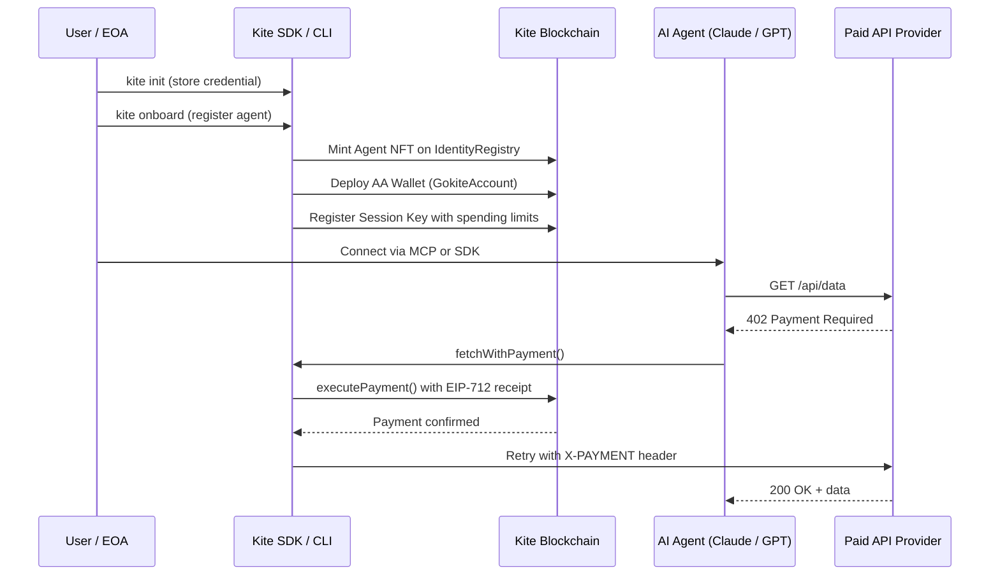

# Kite Agentic Pay

**Kite Agentic Pay** is a decentralized, self-custodied payment infrastructure for AI agents. It lets autonomous agents pay for APIs and compute services on-chain — without centralized custodians, hosted wallets, or API key billing.

> "This is not merely a payment SDK. This is an autonomous payment runtime for AI agents."

---

## Why It Exists

AI agents are increasingly making decisions, calling APIs, and consuming compute resources autonomously. But most payment infrastructure today was designed for humans:

- **API keys** are static secrets that don't express spending limits or agent identity
- **Custodial wallets** require trusting a third party with your funds
- **Stripe-style billing** requires a credit card, identity verification, and a human to set it up
- **Centralized passport systems** hold your agent's identity on their servers

Kite Agentic Pay solves this by giving each AI agent a self-custodied on-chain identity, a bounded spending key, and the ability to pay any compatible API automatically — all from the user's own machine.

---

## How It Works



---

## Integration Surfaces

Kite exposes payment infrastructure at three levels:

| Surface | Best For | Package |
|---|---|---|
| **SDK** | Backend integration, custom agents | `mcp-sdk/` |
| **CLI** | Local setup, wallet management, testing | `npx kite` |
| **MCP Server** | Claude Desktop, Cursor, OpenAI, LangChain | `kite-mcp/` |

---

## Three Payment Models

### 1. x402 Per-Call

Each API call carries a signed EIP-712 payment receipt in the `X-PAYMENT` header. The provider validates and settles immediately. No pre-setup required.

Best for: one-off calls, untrusted agents, low-frequency access.

### 2. Batch Channel

Open a channel once on-chain, make many calls accumulating signed receipts, then settle the aggregate cost in a single transaction.

Best for: groups of related calls, gas efficiency, bounded workflows.

### 3. Stream Channel

A time-governed channel that allows calls over a defined window (e.g., 30 seconds of market data). Auto-closes when the window expires.

Best for: monitoring feeds, recurring tasks, scheduled data collection.

---

## Core Architecture

Four actors make up the system:

| Actor | Role |
|---|---|
| **EOA / User** | Owns funds, creates agents, sets spending limits |
| **Agent** | Acts autonomously using a delegated session key |
| **AA Wallet (GokiteAccount)** | Holds user funds, settles payments on-chain |
| **Service Provider** | Protects APIs behind x402 or channel-based payment |

And four contracts coordinate on-chain:

| Contract | Purpose |
|---|---|
| [`IdentityRegistry`](../smart-contracts/identity-registry) | Agent NFTs, session key registry |
| [`KiteAAWallet`](../smart-contracts/kite-aa-wallet) | Fund custody, per-call payment execution |
| [`PaymentChannel`](../smart-contracts/payment-channel) | Batch/stream channel lifecycle and settlement |
| [`AttestationRegistry`](../smart-contracts/attestation-registry) | Reputation, Merkle audit anchors |

---

## Local-First Philosophy

Kite is built on the belief that agent infrastructure should be **self-custodied and local-first**:

- Session keys never leave the user's machine
- Channel state is persisted locally before any on-chain sync
- The subgraph indexer is optional — recovery works from local state
- No server holds your private keys, agent identity, or spending credentials

See [Local-First Architecture](../concepts/local-first-architecture) for the full rationale.

---

## What's in This Project

```
kite-agentic-pay/
├── mcp-sdk/          ← SDK + CLI (@kite-agentic-pay/sdk)
├── kite-mcp/         ← MCP server for AI agent runtimes
├── backend/          ← Reference provider implementation
├── contracts/        ← Solidity smart contracts (Hardhat)
├── subgraph/         ← The Graph indexer
├── frontend/         ← NextJS dashboard
└── docs/             ← This documentation site
```

---

## Next Steps

- [Quickstart →](./quickstart) — Get running in under 10 minutes
- [Why Kite? →](./why-kite-agentic-pay) — How it compares to alternatives
- [Concepts →](../concepts/agent-identity) — Deep dive into the protocol ideas
