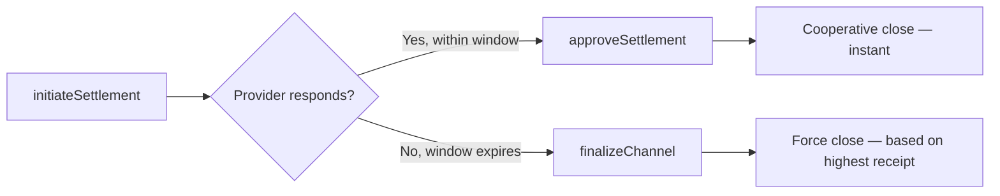

# Demo 5: Channel Settlement

This demo walks through the full settlement lifecycle: cooperative settlement, challenge-based settlement, and force finalization.

**Source:** `mcp-sdk/examples/05-channel-settlement.ts`

## What It Does

1. Opens a channel and makes calls
2. Demonstrates cooperative settlement (provider approves)
3. Demonstrates non-cooperative settlement (challenge window + force finalize)
4. Shows fund distribution in both cases

## Running It

```bash
cd mcp-sdk
npm run demo 5
```

## Expected Output

```
  Demo 5: Channel Settlement
  ─────────────────────────────────────────────────

  Part A: Cooperative Settlement
  ─────────────────────────────────────────────────
  → Opening channel, making 3 calls...
  → Initiating settlement with receipt seq=3, cumCost=1.20 USDT
  → Provider watcher detects SettlementRequested event
  → Provider calls approveSettlement(channelId, 1.20 USDT)
  ✓ Channel closed cooperatively
    Provider earned: 1.20 USDT
    Agent refunded: 3.80 USDT

  Part B: Force Settlement (provider unresponsive)
  ─────────────────────────────────────────────────
  → Opening channel, making 3 calls...
  → Initiating settlement (provider will not respond)...
  → Waiting for challenge window (simulated as 30s in demo)...
  → Calling finalizeChannel()...
  ✓ Channel force-closed
    Provider earned: 0 USDT (no receipt submitted)
    Agent refunded: 5.00 USDT (full deposit)
```

## Cooperative vs Force Settlement



## Key Takeaways

- Cooperative settlement is the normal path and closes the channel immediately
- Force settlement protects the agent if the provider disappears
- The provider is also protected: they can submit their highest receipt during the challenge window
- Both parties are protected by the on-chain contract — neither can steal from the other

## Related Pages

- [Channel Settlement →](../channels/settlement) — Full settlement documentation
- [PaymentChannel Contract →](../smart-contracts/payment-channel)
- [Demo 6: Multi-Provider →](./multi-provider)
